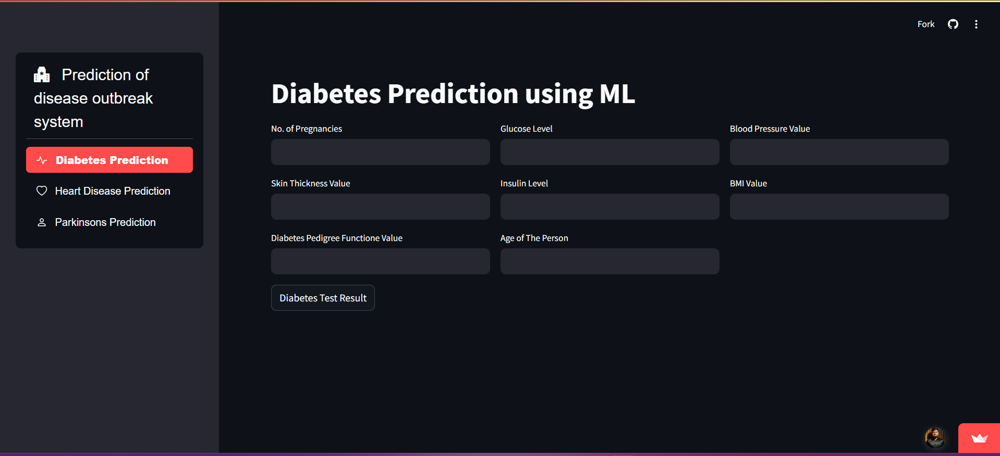
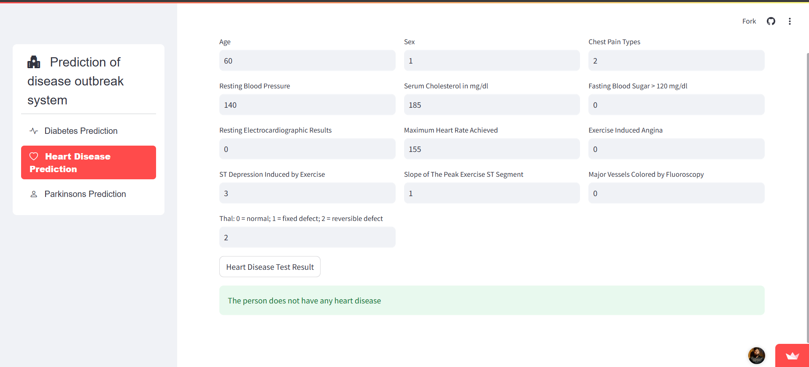
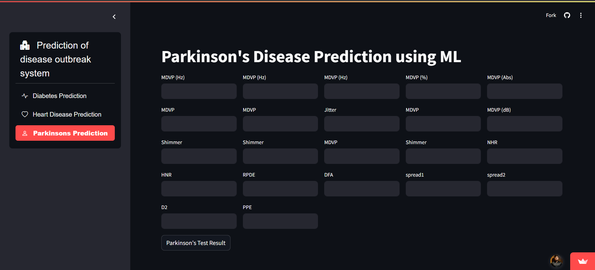

# 🏥 Prediction of Disease Outbreaks using Machine Learning

This project predicts **Diabetes, Heart Disease, and Parkinson’s Disease** using **Machine Learning models**. It features a **user-friendly Streamlit interface** for easy interaction and result visualization.

---

## 📌 Features

✅ Predicts **Diabetes, Heart Disease, and Parkinson’s Disease**  
✅ Uses **Machine Learning models** for accurate predictions  
✅ **User-friendly** Streamlit UI  
✅ Accepts **user input** for real-time prediction  
✅ **Interactive** and easy to use  

---

## 💂️️ Project Structure
```
Prediction-of-Disease-Outbreaks/
│── Data_models/           # Contains trained ML model files (.sav)
│── images/                # UI Screenshots for README
│── app.py                 # Main Streamlit app
│── README.md              # Project description
│── requirements.txt       # Dependencies
```

---

## 🛠️ Technologies Used
- **Python** 🐍  
- **Streamlit** 🌐  
- **Scikit-Learn** 🤖  
- **Pandas & NumPy** 📊  
- **Pickle** (for model storage)  

---

## 🚀 Installation & Setup

### **1⃣ Clone the Repository**
```bash
git clone https://github.com/aniket-bera/Prediction-of-Disease-Outbreaks.git
cd Prediction-of-Disease-Outbreaks
```

### **2⃣ Install Dependencies**
```bash
pip install -r requirements.txt
```

### **3⃣ Run the Application**
```bash
streamlit run app.py
```

---

## 🏥 How It Works

### **1⃣ Choose a Disease**
- Diabetes Prediction  
- Heart Disease Prediction  
- Parkinson’s Prediction  

### **2⃣ Enter Medical Parameters**
- Input values like **glucose level, heart rate, blood pressure, etc.**

### **3⃣ Get Instant Results**
- The model will predict whether the person has the disease or not.

---

## 📊 Machine Learning Models Used
- **Diabetes Prediction:** Support Vector Machine (SVM)  
- **Heart Disease Prediction:** Logistic Regression  
- **Parkinson’s Disease Prediction:** Random Forest Classifier  

---

## 🖼️ Screenshots

### 🔹 **Diabetes Prediction**


### 🔹 **Heart Disease Prediction**


### 🔹 **Parkinson’s Prediction**


---

## 📌 Future Improvements

- ✅ Add more disease predictions  
- ✅ Improve UI with advanced visualizations  
- ✅ Integrate real-time patient data  

---

## 💎 Contact
For questions or collaboration, reach out to **Aniket Bera**:  
💎 Email: [aniketbera.ab@gmail.com](mailto:aniketbera.ab@gmail.com)  

---

**⭐ Don’t forget to star the repository if you find this useful!** 🚀

